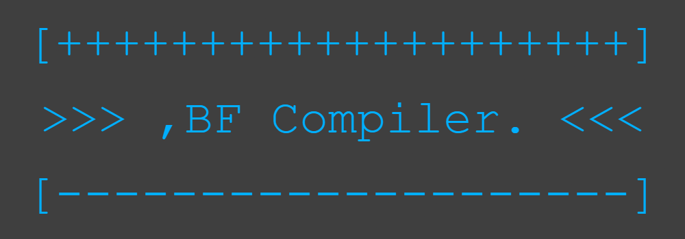

<div style="text-align:center">
    
</div>
<br />
<br />

# Choisauce's BF Compiler

This project by Austin Choi is a (horribly written) 2 stage compiler for the esoteric language brainfuck created by Urban Müller. This compiler will first translate the source code to C++ then use the g++ compiler to compile it down to machine code.

This project was done just as a way to see if I could make a compiler based on what I read up on it. Now I'm properly working on learning compilers with the Stanford EdX course, but I still wanted to try this project out since I've made several bf interpretors in the past.

<h2 id="usage">Usage</h2>

### Debian/Ubuntu

To compile a bf program do
```bash
./bfCompile bfFileName
```

<br />

To run the executable do
```bash
./bf.out
```

### Windows

Haven't worked this out yet so hopefully will get it done soon lol

As for now you can run this in the Debian or Ubuntu WSL and as long as you have the correct dependencies then you'll be fine

## Instalation

### Debian/Ubuntu

To make the compiler first ensure you have all the dependencies
```bash
sudo apt-get update && sudo apt-get upgrade
sudo apt-get install g++
sudo apt-get install make
```

After all the required packages are installed, then run
```bash
make
```

Now you will have a bfCompile executable in the directory. This is the compiler that you can use as mentioned in the <a href="#usage">**Usage**</a> section

### Windows

As mentioned above in the <a href="#usage">**Usage**</a> section, I haven't worked on how to get this running on Windows, but you can do this with the Debian or Ubuntu WSL and run it using the Debian/Ubuntu instructions
